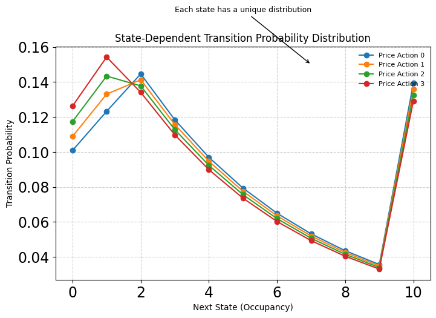

# Reinforcement Learning Specialization – Course 1

In this course, we explore foundational reinforcement learning concepts through hands-on projects. The projects in this repository illustrate how to model complex environments and decision-making processes, covering both full state-based problems and simpler bandit scenarios.

  

---

## Projects Overview

### ParkingWorld (Grid World City)

In this project, we model a parking lot as a Markov Decision Process (MDP). The goal is to understand how pricing strategies influence parking occupancy through state transitions and rewards.

- **States:**  
  Represent the number of occupied parking spaces (from 0 to the maximum capacity).

- **Actions:**  
  Correspond to different pricing levels, influencing driver behavior.

- **Transition Dynamics:**  
  An exponential decay distribution is used to compute transition probabilities. A “center” is determined by balancing current occupancy with a pricing term. Notably, when the lot reaches full capacity, all excess probability is aggregated into the maximum state.

- **Key Learning Points:**  
  - How MDPs can model real-world environments.
  - The impact of control actions (pricing) on state transitions.
  - Visualization of value functions and optimal policies.

### Multi-Armed Bandit Problem

This project addresses the classic exploration-exploitation dilemma through a simplified bandit scenario.

- **The Bandit Problem:**  
  Here, each “arm” represents an action with an uncertain reward. The challenge is to maximize cumulative rewards over time.

- **Exploration Strategies:**  
  Techniques such as \(\varepsilon\)-greedy and Upper Confidence Bound (UCB) are implemented to balance exploring new actions and exploiting known rewards.

- **Key Learning Points:**  
  - Understanding the fundamental trade-off between exploration and exploitation.
  - Comparison of different action-value methods and their performance.
  - Visualization of cumulative reward curves to assess strategy effectiveness.

---

## The Code

The core implementations for both projects are provided in Jupyter notebooks:

- **ParkingWorld Notebook:**  
  Contains the code for modeling the parking environment, calculating transition probabilities, and visualizing the value function and optimal pricing policy.

- **Bandit Notebook:**  
  Implements the multi-armed bandit problem, comparing various exploration techniques and plotting performance metrics over time.

Configuration parameters, such as the number of parking spaces or exploration parameters, are embedded in the notebooks, allowing you to experiment with different settings and observe how these adjustments impact outcomes.

---

## Simulator and Visualization

The projects feature interactive simulations and visualizations designed to clarify key reinforcement learning concepts:

- **Real-Time Visualizations:**  
  Graphs update dynamically to illustrate how changes in pricing or exploration strategies affect outcomes.

- **Deterministic Behavior:**  
  With controlled random seeds, the simulations are repeatable—ensuring that the same configuration yields identical results, which is crucial for understanding and debugging RL algorithms.

- **Intuitive Graphs:**  
  Visual outputs such as transition probability distributions and cumulative reward curves provide clear insights into how the underlying models work.

---

## Results

### ParkingWorld Project Results

  

*Transition Probability Distribution*  
This plot shows how various pricing actions influence the probability of transitioning between different occupancy states. The exponential decay function creates a symmetric distribution around the computed center, with special handling at the boundaries (full capacity).

  

*Value Function and Policy Visualization*  
This figure illustrates the learned value for each state along with the corresponding optimal pricing strategy. The visualization highlights how subtle changes in control actions can significantly influence long-term rewards.

### Bandit Problem Results

The bandit assignment demonstrates the performance of various exploration strategies. The cumulative reward curves clearly illustrate the balance between exploration and exploitation, emphasizing why a well-chosen strategy is crucial in reinforcement learning.

---

These projects collectively build a solid foundation in reinforcement learning. They introduce the key concepts of modeling dynamic environments and managing uncertainty through exploration, preparing you for more advanced topics in subsequent courses.

---

Feel free to explore the notebooks and visualizations, and use them as a basis for further experimentation and learning in reinforcement learning!

